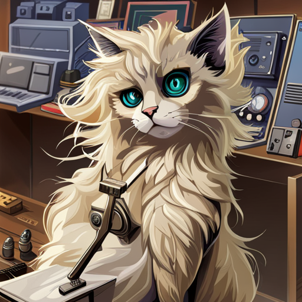

# Dev Cats App

A small example React app (Vite) that displays developer-themed cat profiles.

## About

This repository contains a lightweight React + Vite starter used to showcase a simple employees/cats list UI. It's intended as a demo or starting point for small projects.

## Features

- React with Vite
- Simple components for header, footer, and employee list
- Example images located in `src/images`

## Quick start

Prerequisites: Node.js (16+ recommended) and npm or yarn.

1. Install dependencies

   npm install

2. Start the development server

   npm run dev

3. Open your browser

   Visit http://localhost:5173 (or the port shown by Vite)

## Build

Build the production bundle:

    npm run build

Preview the production build locally:

    npm run preview

## Project structure (important files)

- `src/` – React source files
- `src/images/maleKitty.png` – example image used in this README
- `App.jsx`, `Employees.jsx`, `Header.jsx`, `Footer.jsx` – main components
- `vite.config.js` – Vite configuration

## Contributing

Contributions are welcome. Open an issue or submit a pull request with changes.

## License

This project is provided as-is. Add a license if you plan to reuse or publish it.
